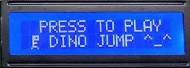
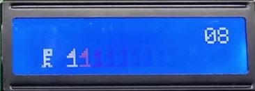
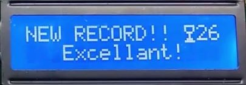

# Dinosaur Game in 8051 ASM

## Hardware

* 8-bit 8051-Compatible microcontroller
* Push-button
* Buzzer
* HD44780-Compatible 1602 LCD Display Module

## Images

  
Start

  
Play

  
Score

## Credit

Guo Shaojun, Chen Yuanbo, and Fang Yuhang  
School of Mechanical Engineering, Sichuan University  
Dec. 2019  
